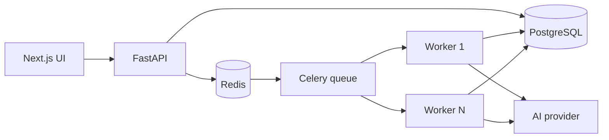

# Asynchronous AI Architecture

CareerPilot now treats expensive AI generation as background work.

PostgreSQL is the source of truth. The `async_tasks` table stores execution state and points at domain results such as `job_analyses` and `interview_sessions`. Redis is used for Celery delivery, shared rate-limit counters, SSE-friendly ephemeral infrastructure, and worker heartbeat keys.

## HTTP Flow

Slow AI endpoints authenticate, validate ownership, enforce rate limits, create an `AsyncTask`, enqueue Celery, and return `202 Accepted`. The frontend polls `GET /api/v1/tasks/{task_id}` and then fetches the resulting `JobAnalysis` or `InterviewSession`.

The migrated workflows are:

- Resume suggestions
- Application draft
- Role analysis
- Preparation plan
- Interview session/question generation

Interview answer feedback remains synchronous because it is part of a tight one-question practice loop and normally returns a small response. If latency becomes noticeable, it can use the same task model later.

## Delivery Semantics

Celery is configured with late acknowledgements, worker-lost rejection, prefetch multiplier `1`, and Redis visibility timeout. This is at-least-once delivery, not exactly-once.

Tasks may execute more than once after a worker crash. Generated domain rows carry `async_task_id`, and services first look up an existing result for that task before creating a new one. This makes successful result creation effectively idempotent for a retried task.

## Retries

Workers retry sanitized transient AI provider failures with exponential backoff and jitter. Missing or invalid local data is treated as non-retryable and marks the task `FAILED`. OpenAI SDK retries remain low through `OPENAI_MAX_RETRIES`; Celery owns the broader workflow retry.

## Idempotent Submission

AI POST routes accept an optional `Idempotency-Key` header. The key is scoped by user and task type. Retrying the same logical click with the same key returns the existing task, while later regenerations without the same key still create new work.

## Rate Limiting

Rate limits use Redis sorted sets so multiple backend instances share counters. If Redis is unavailable, the system falls back to the existing in-memory limiter. That keeps the app usable but only enforces limits per API process until Redis returns.

## SSE

`GET /api/v1/tasks/{task_id}/events` streams current task status and enforces task ownership. Correctness does not depend on receiving every event; clients can reconnect or poll `GET /api/v1/tasks/{task_id}`.

## Health

`/api/v1/health` remains a lightweight liveness endpoint. `/api/v1/health/ready` checks PostgreSQL, Redis, and recent worker heartbeat keys. Worker heartbeats are stored in Redis with a TTL and are not persisted historically.
